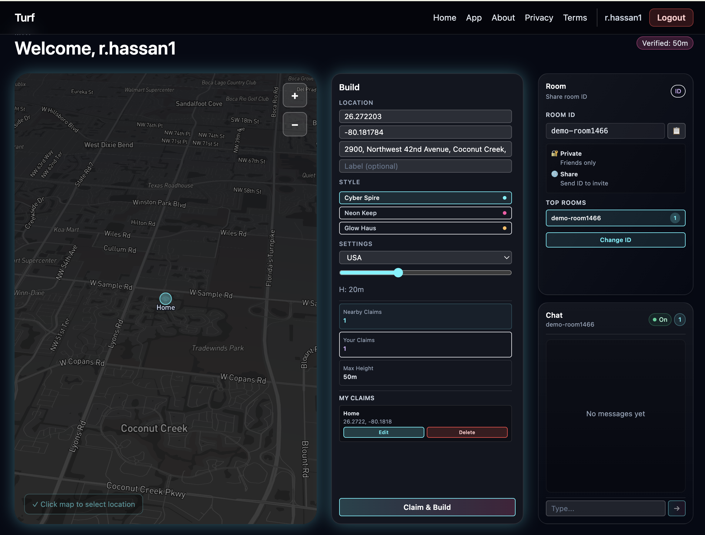

# Turf (USA beta)

"Claim your territory" — verified home base, hyperlocal visibility, voxel flexing. This repo contains:
- `api/`: FastAPI + PostGIS backend (claims, nearby, builds).
- `web/`: Next.js PWA shell with Mapbox view (USA-only placeholder).
- `infra/`: Docker Compose for local PostGIS + API.



## Quick start (local, Docker)
```bash
cd infra
cp ../api/.env.example ../api/.env
docker-compose up --build
```
API will be on http://localhost:8000 (health at `/health`). DB on localhost:5432.

## Manual dev
### API
```bash
cd api
python -m venv .venv && source .venv/bin/activate
pip install -r requirements.txt
cp .env.example .env
uvicorn app.main:app --reload
```

### Web (PWA shell)
```bash
cd web
npm install
cp .env.local.example .env.local   # add NEXT_PUBLIC_MAPBOX_TOKEN
npm run dev
```

## Environment
- USA-only scope initially; clamp client controls to continental US.
- `NEXT_PUBLIC_MAPBOX_TOKEN` required for map; dusk/dark style default.
- `DATABASE_URL` uses PostGIS; claims use ST_DWithin for 2km proximity.

## API surface (v0)
- `POST /users` { handle }
- `POST /claims` { owner_id, lat, lon, address_label } unique within ~20m
- `GET /nearby?lat&lon&radius_m=2000` list claims within radius
- `POST /builds` attach prefab/decal/flag/height to a claim (one per claim now)

## Roadmap (next)
- Stripe/Persona verification webhook -> mark `users.verified`.
- Height caps: free 5m, verified 50m enforced at build creation.
- WebSocket presence + drive-by pings.
- Voxel prefab rendering via Threebox (map-anchored 3D).
- Abuse protections: rate limits, US geofence, weekly re-verify presence.


